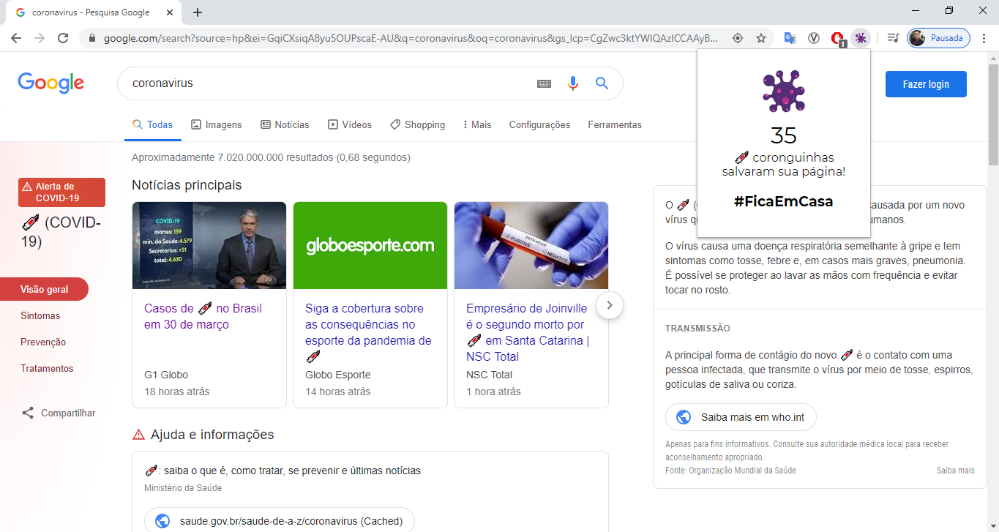

# coronguinha

> Minha extensão para o navegador [Google Chrome](https://www.google.com/intl/pt-BR/chrome) para participar do [sorteio do @codigofalado](https://twitter.com/codigofalado/status/1244296923424702465)

## Features

- Ao clicar na extensão, é informado o número de vacinas coronguinhas que salvaram a página.

## Observação

- Caso o número de vacinas esteja como 0, recarregue a página.

## Como usar?

1. Baixe o projeto (https://github.com/srizzon/coronguinha) para algum diretório conhecido
2. Em seu navegador, vá para a página **`chrome://extensions`**
3. Ative a checkbox **Developer mode**
4. Clique no botão **Load unpacked** e selecione o diretório extraído no passo (1)

---

- animation (c) https://lottiefiles.com/2147-virus-cell
- font (c) https://fonts.google.com/specimen/Montserrat